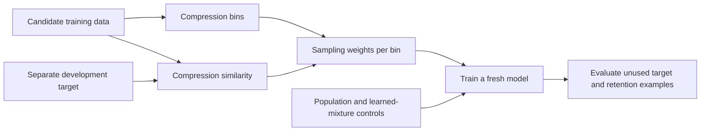

# Zip-Mix: validation-guided training-data mixtures

**Doc link:** <https://github.com/brando90/zip-mix/blob/main/README.md>

**TLDR:** Zip-Mix groups training text by compression ratio and chooses sampling weights using similarity to a separate development set. We are testing whether this improves held-out language modeling and supervised fine-tuning; superiority over established baselines remains an open hypothesis.

Zip-Mix builds on [Compel](https://openreview.net/forum?id=KFafeqE5fe), which filters pretraining data using compression ratios, and [ZIP-FIT](https://arxiv.org/abs/2410.18194), which estimates target alignment using compression distance. The intended benefit is inexpensive, target-aware data selection before expensive model training.

## Research question

Can validation-aligned compression buckets improve generalization over token-proportional sampling, Domain Reweighting with Minimax Optimization (DoReMi), Domain Reweighting with Generalization Estimation (DoGE), and strong modern data-selection methods at competitive total cost?

A small validation set describes a chosen target distribution. Success on that distribution does not establish universal optimality or artificial general intelligence. We separate unseen examples of the same target, retention on other domains, and genuinely new task-family transfer.

## Current work

| Experiment | Purpose | Latest status |
|---|---|---|
| [04: validation-guided pretraining](experiments/04_validation_guided_zipmix/README.md) | From-scratch mechanism screen: nine methods, three paired seeds, held-out target and broad loss | 27/27 complete; small sampling-control gains, below the compact DoGE comparator |
| [05: validation-guided supervised fine-tuning](experiments/05_validation_guided_sft/README.md) | Pretrained-model benchmark accuracy with fixed labeled-token budgets | Full 21-cell fixed-byte run active; results pending |
| [06: contrastive validation-guided selection](experiments/06_contrastive_validation_zipmix/README.md) | True-minus-wrong development alignment with a source-matched control | Full nine-cell study running; base complete; benchmark results pending |
| [02: prior analysis](experiments/02_alignment_prior_analysis/README.md) | Compression distributions from public corpus pilots | Existing cached pilot reused with its limitations recorded |
| [03: proxy-mixture proposal](https://github.com/brando90/zip-mix/blob/main/experiments/03_zipmix_doremi_fix/README.md) | Earlier larger pretraining design | Preserved proposal, not executed by the new screen |

[Experiment index](experiments/README.md) · [Research plan and current literature](experiments/04_validation_guided_zipmix/research_design.md) · [Live pretraining results](experiments/04_validation_guided_zipmix/results.md)

## Method and important distinctions

For document `d`, compression ratio is compressed bytes divided by raw bytes. Compression bins partition the corpus. A bucket prior sums nonnegative development-alignment scores and then normalizes across nonempty buckets. A hierarchical sampler selects a bucket and then training data within it.

The historical Zip-Mix draft uses maximum similarity over development examples. The published ZIP-FIT algorithm uses mean similarity; experiments label these separately. The runnable pretraining screen uses equal-length token blocks and weights by their mass, a documented extension of the draft's document-level sampler.



**Development targeting must improve outcomes on unused examples.** Evaluation scores never feed back into the frozen mixture, training budget, or stopping decision. Fixed training seeds pair methods; separate costs account for preprocessing and learned-mixture reference/proxy training.

When alignment scores are nearly constant, the sum-of-scores prior is almost the population prior. A concentrated histogram alone therefore cannot demonstrate useful targeting. Comparisons include population sampling, uniform buckets, Compel, direct compression alignment, and a shuffled-alignment control.

DoReMi uses a trained reference and **excess loss**, not simply raw loss on difficult data. DoGE uses gradient alignment with a target development distribution. Compact local adaptations are labeled explicitly; paper-scale reproductions and competitive tuning remain necessary for claims against those methods. Equal final-training tokens are reported separately from total cost, including reference/proxy models, scoring and tuning.

## Layout and execution

```text
experiments/             # plans, experiment-specific code, manifests, reports
paper_latex_and_notes/   # historical paper drafts and research notes
AGENTS.md, CLAUDE.md     # synchronized project instructions
```

Each active experiment owns its runnable commands, frozen configuration, data provenance, deterministic checks and live results. Large corpora, checkpoints and private host receipts stay outside Git. Follow the experiment runbook rather than launching an unconstrained corpus-scale run from this overview.

## References and project materials

- [DoReMi paper](https://arxiv.org/abs/2305.10429) and [official implementation](https://github.com/sangmichaelxie/doremi)
- [DoGE paper](https://arxiv.org/abs/2310.15393) and [official implementation](https://github.com/Olivia-fsm/DoGE)
- [Aioli implementation](https://github.com/HazyResearch/aioli), [Olmix](https://arxiv.org/abs/2602.12237), [On-Policy Mix](https://arxiv.org/abs/2605.15220): relevant modern comparisons, currently researched rather than reproduced
- [Earlier literature notes](experiments/00_related_work/README.md), containing historical claims that require source verification
- [Paper workspace](https://www.overleaf.com/project/6861da6f7c236a3466d7e749), [slides](https://docs.google.com/presentation/d/1XoQ24_KofQUOeSxLE_lNVjYAw0lMtsm9spF6ertwL7s/edit), [research journal](https://docs.google.com/presentation/d/1cI569bcyQpxB66MUnflvBBXJKxe26GDodLig1xQ1iEI/edit)

Project contributors: Brando Miranda, Elyas Obbad and Sanmi Koyejo.
