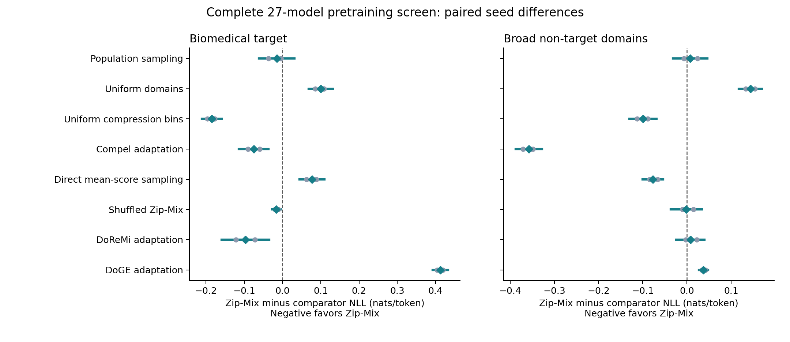

# Complete pretraining screen: loss and perplexity

All 27 frozen training cells have audited outcomes. Three paired seeds per method; intervals condition on the fixed corpus and evaluation items.

Negative log likelihood (NLL) is in nats per predicted token. Perplexity is exp(mean seed NLL), with endpoints transformed from its 95% Student-t interval; it is not the arithmetic mean of seed perplexities. Absolute means have p-val=n/a: no arbitrary level null was tested.

Domain Reweighting with Minimax Optimization (DoReMi) and Domain Reweighting with Generalization Estimation (DoGE) are compact adaptations using the same-size proxy and final models. Their extra reference/proxy costs are included in the measured stage time.

| Method | Target NLL [95% interval] | Target perplexity [95% interval] | Seed NLL standard deviation | Broad perplexity [95% interval] | Total training-stage seconds (3 runs) |
|---|---|---|---:|---|---:|
| Population sampling | 5.1765 [5.1412, 5.2118] | 177.0619 [170.9129, 183.4322] | 0.01423 | 123.7792 [122.0481, 125.5348] | 116.87 |
| Uniform domains | 5.0613 [5.0390, 5.0835] | 157.7880 [154.3109, 161.3435] | 0.00897 | 108.0043 [107.3170, 108.6961] | 114.95 |
| Uniform compression bins | 5.3462 [5.3279, 5.3644] | 209.8009 [206.0096, 213.6620] | 0.00734 | 137.7286 [134.1295, 141.4242] | 118.30 |
| Compel adaptation | 5.2366 [5.2006, 5.2727] | 188.0319 [181.3730, 194.9352] | 0.01451 | 178.2372 [173.2170, 183.4028] | 128.64 |
| Zip-Mix | 5.1616 [5.1469, 5.1762] | 174.4365 [171.9061, 177.0041] | 0.00588 | 124.6678 [121.5247, 127.8921] | 113.10 |
| Direct mean-score sampling | 5.0846 [5.0655, 5.1038] | 161.5228 [158.4550, 164.6500] | 0.00772 | 134.6134 [134.2872, 134.9404] | 117.86 |
| Shuffled Zip-Mix | 5.1779 [5.1536, 5.2021] | 177.3039 [173.0617, 181.6501] | 0.00975 | 124.8838 [123.2288, 126.5609] | 122.19 |
| DoReMi adaptation | 5.2585 [5.1867, 5.3303] | 192.1912 [178.8731, 206.5009] | 0.02891 | 123.6930 [122.8933, 124.4979] | 191.60 |
| DoGE adaptation | 4.7489 [4.7291, 4.7687] | 115.4580 [113.1938, 117.7675] | 0.00797 | 120.1059 [118.3186, 121.9202] | 285.94 |

The prespecified descriptive screening heuristic is not met. It requires at least 0.02 lower mean target NLL than population and shuffled controls, a lower target loss in every paired seed, and no more than 0.02 broad-loss increase relative to either control. The threshold rule is evaluated descriptively, p-val=n/a: no inferential test against the 0.02 threshold was run. See screening_decision.json for each component and analysis.md for every paired interval and exact sign-test p-value.

All comparisons are exploratory and unadjusted for multiple comparisons. At three non-tied pairs the minimum two-sided sign-test p-value is 0.25. Equal final predicted-token budgets do not imply equal total compute.

**Zip-Mix did not meet the prespecified descriptive screening criterion.** Points are individual seed differences; bars are 95% paired-seed Student-t intervals. Negative values favor Zip-Mix; intervals are conditional on the fixed data and do not establish broad superiority.
