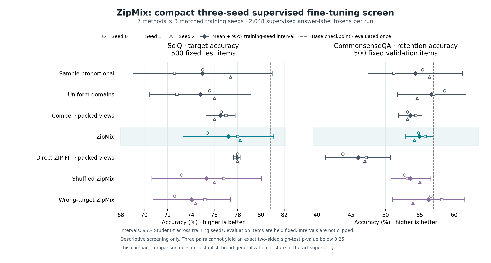

# Experiment 05: validation-guided supervised fine-tuning

**Doc link:** <https://github.com/brando90/zip-mix/blob/main/experiments/05_validation_guided_sft/README.md>

**TLDR:** All 21 training cells and the base evaluation completed. ZipMix's paired target-accuracy advantage over sample-proportional sampling was +2.20 [−4.70, 9.10] percentage points, p-val=0.25 (exact sign test); competitive superiority remains unresolved.

Version 2 is the completed prospective experiment. Updated 10-04-2026: the full 21-cell run operated from 12:08 to 13:56 Pacific Daylight Time on one A100 after 38 remote tests and all input/source hash checks passed. All 21 training cells and the unchanged-base evaluation completed with zero failures, missing cells or infrastructure resumptions. Terminal analysis and independent process-release checks passed; all 69 exported proof artifacts remain byte-identical to their sources.

The user-requested single Opus 5.5 maximum-effort quality-assurance review found that version 1's short-string compression scores mostly tracked length. [Version 1 remains an untrained calibration](expt_v1/STATUS.md). Version 2 repairs the scoring unit before training: every candidate and development view contains exactly 4,096 real bytes, with a matched wrong-target control. No artificial padding or repetition fills views.

The scientific question is whether changing the development-target compression prior improves held-out science accuracy at a fixed supervision budget. ZipMix reached 77.20% [73.32, 81.08] target accuracy across three training seeds (95% Student-t interval; p-val=n/a because no test of a single method's accuracy level was run). Its mean exceeded sample-proportional, shuffled and wrong-target sampling, but remained below direct ZIP-FIT's 77.93% [77.65, 78.22] (p-val=n/a). These descriptive results do not establish broad generalization superiority.

| ZipMix minus comparison | Target accuracy difference, percentage points [95% paired-seed interval] | Exact two-sided sign-test p-value |
|---|---:|---:|
| Sample-proportional | +2.20 [−4.70, 9.10] | 0.25 |
| Shuffled ZipMix | +1.87 [0.43, 3.30] | 0.25 |
| Wrong-target ZipMix | +3.13 [1.70, 4.57] | 0.25 |
| Direct ZIP-FIT adaptation | −0.73 [−4.75, 3.28] | 1.00 |

Every comparison uses the same three matched training seeds and 500 fixed SciQ test items. Intervals describe training-seed variability conditional on those items; the items are not independent training repetitions. Tests are exploratory and unadjusted, with null probability 1/2 of a positive non-tied seed difference. Three non-tied pairs cannot yield a two-sided sign-test p-value below 0.25, even when a descriptive Student-t interval excludes zero.

The unchanged base checkpoint scored 404/500 = 80.80% once (training-seed interval unavailable; p-val=n/a). ZipMix's mean was 3.60 percentage points lower; the difference conditional on that fixed base evaluation was −3.60 [−7.48, 0.28] percentage points across the three training seeds (p-val=n/a; no base-comparison test was run). The experiment therefore does not show an improvement over leaving the base checkpoint unchanged.



**ZipMix's relative gains remain uncertain in this three-seed screen.** Points show individual training seeds and means with descriptive 95% Student-t intervals; the base is evaluated once. Target and retention sets each contain 500 fixed examples. The full [measured summary](expt_v2/results/measured/results_summary.md) preserves every method and seed; the [export receipt](expt_v2/results/measured/EXPORT_RECEIPT.json) records independent verification and exact source/export hashes.

| Item | Frozen version 2 choice |
|---|---|
| Backbone | Pinned Qwen2.5-0.5B base checkpoint |
| Training pool | 9,797 examples from SciQ, OpenBookQA, ARC-Challenge, and CommonsenseQA, arranged into 351 disjoint source-specific packs |
| True development target | Eight 4,096-byte SciQ validation packs |
| Wrong development target | Eight matched-byte CommonsenseQA packs from 256 reserved training records excluded from every arm |
| Target evaluation | 500 fixed SciQ test examples |
| Retention evaluation | 500 fixed CommonsenseQA validation examples |
| Mixtures | Sample-proportional, source-uniform, Compel, historical maximum-score ZipMix, mean-score direct ZIP-FIT adaptation, shuffled-score ZipMix, wrong-target ZipMix |
| Training | Seven methods × three seeds = 21 cells; 128 steps × 16 examples = 2,048 supervised answer-label tokens per cell |
| Precision | Full fine-tuning with float32 master parameters/optimizer states and bfloat16 forward autocasting |
| Outcome | Multiple-choice accuracy; answer-label negative log likelihood is secondary |


**Changing the development target changes the frozen training mixture.** All scoring views contain 4,096 real bytes; values are exact finite-pool probabilities, not performance estimates. Source and pack-density confounds remain.

The true-target ZipMix mixture places 35.87% mass on SciQ, versus 26.93% for the wrong target and 30.53% for sample-proportional sampling. True-versus-wrong mixture total variation is 0.13953; true-versus-shuffled total variation is 0.06509. These describe the complete frozen pool exactly, not sampled performance estimates (p-val=n/a). All seven methods have support; Compel retains 9,722 of 9,797 examples. Its near-natural mixture is reported rather than made artificially selective.

The full [protocol](expt_v2/PROTOCOL.md), [public input manifest](expt_v2/data_manifest.json), [execution prompt](expt_v2/cc.md), [final results](results.md), and [checkpoint](CKPT_validation_guided_sft.md) are canonical. Raw public datasets, token arrays, model weights, and training run directories remain ignored and preserved on execution-host scratch storage with private paths recorded by the coordinator. The explicit [public export](expt_v2/results/measured/EXPORT.md) contains receipts and held-out predictions without raw questions or checkpoints.

```text
05_validation_guided_sft/
  README.md
  results.md
  CKPT_validation_guided_sft.md
  expt_v1/                 # preserved untrained calibration and original protocol
  expt_v2/
    PROTOCOL.md
    cc.md
    data_manifest.json
    common.py
    prepare_sft.py
    train_sft.py
    analyze_sft.py
    test_sft.py
    test_analysis.py
    test_packs.py
    results/mixture_diagnostics.png
    results/measured/      # verified public receipts, predictions and figures
    data/                  # ignored prepared input artifacts
    runs/                  # ignored weights, predictions, durable ledgers
```

Use the verified Stanford Network Analysis Project (SNAP) runtime described in [Experiment 04 preflight](../04_validation_guided_zipmix/preflight.md). Run each version's tests in a separate process because the versioned scripts intentionally have the same module names.

```bash
python experiments/05_validation_guided_sft/expt_v2/prepare_sft.py
python -m pytest experiments/05_validation_guided_sft/expt_v2/ -q
CUDA_VISIBLE_DEVICES=0 python experiments/05_validation_guided_sft/expt_v2/train_sft.py --data experiments/05_validation_guided_sft/expt_v2/data --output experiments/05_validation_guided_sft/expt_v2/runs/screen
python experiments/05_validation_guided_sft/expt_v2/analyze_sft.py --run experiments/05_validation_guided_sft/expt_v2/runs/screen
```

The device index is an example; the coordinator must recheck availability and bind exactly one suitable graphics processing unit. Preparation refuses to overwrite frozen inputs. The trainer checks input/code identities, saves recoverable state every 16 steps, and preserves every failed row. A durable external supervisor must cover the full manifest and require successful base evaluation as well as all training cells.

Three seeds permit descriptive paired-seed intervals, with weak small-sample precision; an exact two-sided sign test cannot attain p<0.25 at three non-tied pairs. No confirmatory significance or optimality claim follows from this screen. CommonsenseQA training data remain in the pool, so its evaluation is untargeted retention/transfer rather than an unseen family. The pretrained backbone may have benchmark exposure. Direct ZIP-FIT uses inherited pack scores here, and Compel is applied to packs of benchmark questions; neither is a faithful reproduction of its original setting. Comparisons against faithful DoReMi, DoGE, LESS, and current mixing competitors remain separate research stages.

Sources: [Qwen model](https://huggingface.co/Qwen/Qwen2.5-0.5B), [SciQ](https://huggingface.co/datasets/allenai/sciq), [OpenBookQA](https://huggingface.co/datasets/allenai/openbookqa), [ARC](https://huggingface.co/datasets/allenai/ai2_arc), [CommonsenseQA](https://huggingface.co/datasets/tau/commonsense_qa), [ZIP-FIT algorithm](https://arxiv.org/html/2410.18194v2#S2), [Compel](https://github.com/stair-lab/compel).
