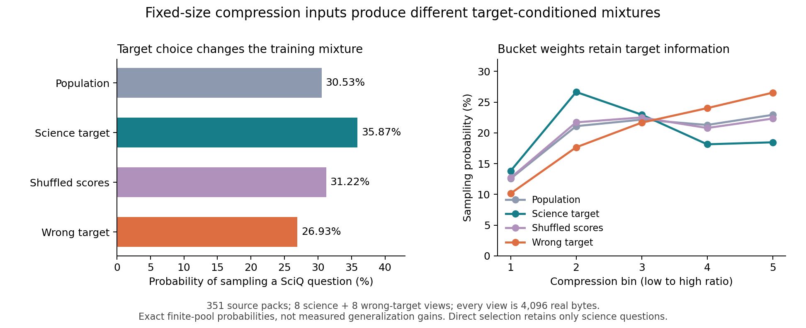

# Experiment 05 live results

**Doc link:** <https://github.com/brando90/zip-mix/blob/main/experiments/05_validation_guided_sft/results.md>

Updated 10-04-2026. Active condition: version 2, using fixed-byte compression packs and true/wrong-target controls. Model training and benchmark performance remain unmeasured by the implementation worker.

Version 1 is preserved as an untrained calibration after the requested single Opus 5.5 maximum-effort review identified length confounding. The coordinator authorized version 2 prospectively before benchmark evaluation; the review was not repeated.

| Stage | Verified status |
|---|---|
| Immutable source/model revisions | Preserved from version 1 |
| Candidate pool | 9,797 examples; 351 disjoint source-specific packs |
| Development targets | Eight true and eight wrong-target views, exactly 4,096 real bytes each |
| Reserve and tails | 256 CommonsenseQA records reserved outside training; 63 underfilled-tail examples excluded from every arm |
| Evaluation sets | Same fixed 500 SciQ and 500 CommonsenseQA examples as untrained version 1 |
| Split audit | Zero exact or declared 13-word overlap hits between candidates and protected true/wrong/evaluation records |
| Deterministic validation | 38/38 tests passed; input/source hashes and all scoring views reproduced |
| Method support | All seven methods available; Compel support 9,722/9,797 |
| Base evaluation | Not run by implementation worker |
| Training | 0/21 measured cells completed by implementation worker |

Public [version 2 manifest](expt_v2/data_manifest.json) identity: `0d6dec93e7d7ccffd87f95e7ebd19e78c84ec72a546007b122888789aba5cb44`. The scientific procedure is [expt_v2/PROTOCOL.md](expt_v2/PROTOCOL.md).

**The frozen prior responds to the development target.** True-target ZipMix assigns 35.87% mass to SciQ versus 26.93% under the reserved CommonsenseQA target. Their total variation is 0.13953; true versus global pack-score permutation is 0.06509. These are exact finite-pool probabilities, with no performance test (p-val=n/a). They establish distinct training interventions, not a model-quality benefit. All 367 candidate/development views have exactly 4,096 real bytes; source, repetition, and pack-density effects remain.



**Changing the development target changes the frozen training mixture.** All scoring views contain 4,096 real bytes; values are exact finite-pool probabilities, not performance estimates. Source and pack-density confounds remain.

The implementation agent did not launch graphics-processing-unit training. The parent coordinator owns the durable full-manifest launch and will update these records with run identity and measured receipts. A completed calibration or changed prior is not a completed scientific experiment.

**TLDR-end:** [zip-mix: SFT v2] The prospective length-controlled inputs and distinct target controls are ready; all 21 model-training cells and the base evaluation remain pending in this implementation checkpoint.

**Snapshot:**
```text
train_examples=9797
training_packs=351
bytes_per_scoring_view=4096
true_views=8
wrong_views=8
available_methods=7
expected_training_cells=21
```
