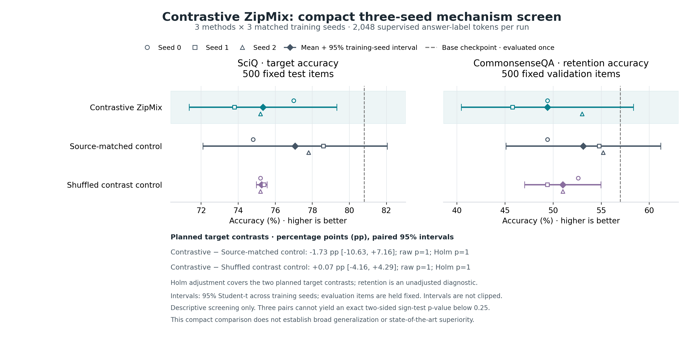

# Experiment 06: contrastive alignment did not outperform its controls

**Doc link:** <https://github.com/brando90/zip-mix/blob/main/experiments/06_contrastive_validation_zipmix/results.md>

**TLDR:** All nine models and the base evaluation completed cleanly. Contrastive ZipMix scored 75.33% target accuracy versus 77.07% with matching source proportions and 75.27% with shuffled contrast scores; the planned comparisons do not support an alignment benefit in this setting.

Completed 10-04-2026 at 13:13 PDT. This prospective study uses Qwen2.5-0.5B, three methods × three training seeds, and 2,048 supervised answer-label tokens per model. Selection was frozen before any Experiment 05 benchmark outcome was inspected. Both primary and source-matched methods assign exactly 58.3210% of the frozen sampling probability to SciQ science questions; the shuffled control assigns 31.3883%. These are exact finite-pool probabilities, p-val=n/a.

## Measured outcomes

Each model was evaluated on the same 500 SciQ test questions and 500 CommonsenseQA validation questions. Intervals are descriptive 95% Student-t intervals across the three independent training seeds, conditional on these fixed questions. They do not quantify uncertainty over new tasks, corpora or benchmark questions. Standard deviations describe variability across training seeds. Absolute accuracy levels have p-val=n/a; no test against an arbitrary accuracy level was run.

| Method | Target accuracy % [95% interval] | Target standard deviation, percentage points | Retention accuracy % [95% interval] | Retention standard deviation, percentage points |
|---|---:|---:|---:|---:|
| Contrastive ZipMix | 75.333 [71.348, 79.318] | 1.604 | 49.400 [40.457, 58.343] | 3.600 |
| Matching source proportions | 77.067 [72.090, 82.043] | 2.003 | 53.133 [45.086, 61.180] | 3.239 |
| Shuffled contrast scores | 75.267 [74.980, 75.554] | 0.115 | 51.000 [47.025, 54.975] | 1.600 |

The unchanged base checkpoint scored 404/500 = **80.800%** target accuracy and 285/500 = **57.000%** retention accuracy. These are one deterministic evaluation each, with no training-seed interval or p-value. Every one of the nine trained models scored below the base on both metrics; this is a property of the observed run set, not a universal claim about fine-tuning.

| Contrastive ZipMix minus control | Target difference, percentage points [95% interval] | Raw p-value | Holm-adjusted p-value | Retention difference, percentage points [95% interval] | Raw p-value |
|---|---:|---:|---:|---:|---:|
| Matching source proportions | −1.733 [−10.625, 7.159] | 1.0 | 1.0 | −3.733 [−15.389, 7.922] | 0.5 |
| Shuffled contrast scores | 0.067 [−4.159, 4.292] | 1.0 | 1.0 | −1.600 [−9.361, 6.161] | 1.0 |

Tests are exact two-sided sign tests of the null that either method has equal probability of higher accuracy among non-tied training seeds. Holm adjustment covers the two prospectively declared target comparisons; retention tests are unadjusted diagnostics. With three non-tied pairs the smallest raw p-value is 0.25. Student-t intervals and sign tests use different assumptions and are not interchangeable significance decisions. No confirmatory superiority conclusion follows.



**Contrastive alignment did not outperform the control with matching source proportions.** Points are individual training seeds; diamonds and bars are seed means and 95% intervals. Dashed lines mark the unchanged base. The complete seed table is in the [unaltered remote analysis](expt_v1/results/measured/results_summary.md); [machine-readable results](expt_v1/results/measured/summary.json) and saved per-item predictions preserve every declared cell.

## Interpretation and next decision

This variant clips the pack-level difference between alignment to true and wrong development targets, then aggregates it into compression-bin weights. The control matches the four source probabilities and samples uniformly within each source. The primary comparison therefore asks whether the resulting selection helps beyond source proportions. Its observed mean is lower, with a wide interval; the shuffled comparison is essentially flat. The data do not support scaling this exact contrastive formulation as an established improvement.

The base comparison also shows that this particular full-model, answer-label fine-tuning setup degraded the observed benchmark scores. That warrants a separately designed training calibration before a larger competitive study; it does not identify whether learning rate, supervision format, candidate quality or another mechanism caused the regression. No setting is changed or selected using these test outcomes. Experiment 05 subsequently finished all 21 cells. The [complete cross-study analysis](cross_experiment/comparison.md) verifies the shared inputs and reports all seven exploratory target comparisons; none is an independent replication. Contrastive ZipMix minus the original Zip-Mix has target difference −1.867 [−9.472, 5.739] percentage points, raw and Holm-adjusted exact sign-test p-val=1.0, using the same three-seed interval convention.

Matching source proportions does not match the joint source-by-compression table. A proposed [conditional-selection study](../04_validation_guided_zipmix/NEXT_STAGE_DESIGN.md) would hold that joint table fixed and test alignment within groups, but it has not been launched. It requires fresh uninspected held-out questions and its own admission checks. A later direct-score comparison is still needed to establish whether bins add value. Faithful competitive baselines and reinforcement learning remain untested here.

CommonsenseQA training questions occur in the candidate pool, so its held-out scores measure untargeted retention within a seen training family. Pretraining exposure to these public benchmarks is not excluded. All scoring views contain 4,096 real bytes, but pack density, repetition and inherited scores remain possible influences. Three seeds on one small backbone cannot establish broadly optimal training or state-of-the-art superiority.

## Procedure, cost and provenance

- Full matrix: **9/9 training cells and 1/1 base evaluation complete**, zero failed or missing cells, zero infrastructure resumes. Training and analysis both exited successfully; all prediction audits passed.
- Source: [`ab85f460`](https://github.com/brando90/zip-mix/commit/ab85f46074d0e479f39369cb0fe7fa0751876ef2). Run identity: `b67673d75e6d5e9ac6bf962cfe65202d095e43c02262b35063717f994aaf35a5`. The [freeze receipt at that commit](https://github.com/brando90/zip-mix/blob/ab85f46074d0e479f39369cb0fe7fa0751876ef2/experiments/06_contrastive_validation_zipmix/expt_v1/freeze_receipt.json) binds the original source and documents; live reports subsequently evolve.
- Prelaunch checks: **35/35 tests**, all 12 data-file hashes, both preparation-source hashes and 14 frozen source/document hashes verified. The trainer is byte-identical to Experiment 05 version 2.
- Actual supervisor wall time: **1,348.092 seconds**, versus a 7,200-second ceiling, on one A100 graphics processing unit. Training plus analysis spanned 1,329.796 seconds. All exact owned process identities exited; independent release checks found no process remnants and zero used accelerator memory.
- Full training supervision: **18,432 answer-label tokens** and **910,362 non-padding prompt tokens**. Recorded per-cell training time sums to **1,123.949 seconds**; this includes checkpoint writing, and is not pure accelerator compute time. Dollar cost is unavailable.
- Checkpoints occur every 64 updates here, versus every 16 in Experiment 05. This operational difference makes cross-study elapsed-time comparisons unsuitable for claims about selector efficiency.
- All **33 exported remote proof files** were preserved byte-for-byte. Independent local analysis reproduces every mean, count, p-value and non-interval scientific field exactly; 95% interval endpoints differ by at most **1.45 × 10⁻¹²** due to local/remote numerical-library versions. The original remote outputs remain canonical. [Export verification](expt_v1/results/measured/EXPORT.md) records hashes and the precise comparison policy.

**TLDR-end:** [zip-mix: contrastive result] The full nine-run experiment completed cleanly, but it did not show a benefit beyond matching source proportions. Its observed benchmark accuracy also trailed the unchanged base; larger claims remain unsupported.

**Snapshot:**
```text
complete_training_cells=9/9
base_evaluation=complete
failed_or_resumed_cells=0
target_difference_vs_source_matched_pp=-1.733
paired_95_percent_interval_pp=[-10.625, 7.159]
exact_sign_test_p=1.0; Holm_p=1.0
owned_gpu_processes_after_completion=0
```
